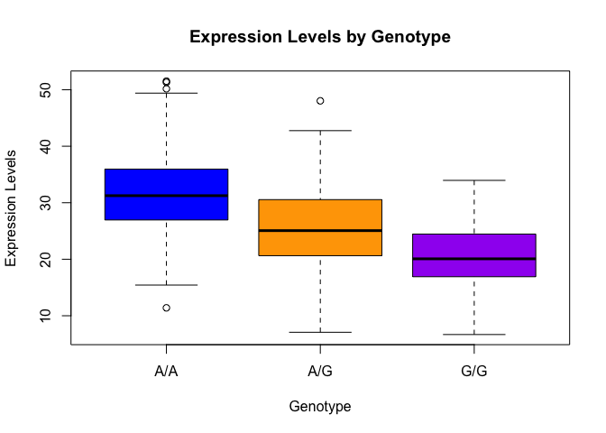

# Class 12
Gonzalez A16745338

# Section 1. Proportion og G/G in a population

Downloaded a CSV file from Ensemble

Here we read this CSV file

``` r
mxl <- read.csv("373531-SampleGenotypes-Homo_sapiens_Variation_Sample_rs8067378.csv")

head(mxl)
```

      Sample..Male.Female.Unknown. Genotype..forward.strand. Population.s. Father
    1                  NA19648 (F)                       A|A ALL, AMR, MXL      -
    2                  NA19649 (M)                       G|G ALL, AMR, MXL      -
    3                  NA19651 (F)                       A|A ALL, AMR, MXL      -
    4                  NA19652 (M)                       G|G ALL, AMR, MXL      -
    5                  NA19654 (F)                       G|G ALL, AMR, MXL      -
    6                  NA19655 (M)                       A|G ALL, AMR, MXL      -
      Mother
    1      -
    2      -
    3      -
    4      -
    5      -
    6      -

``` r
table(mxl$Genotype..forward.strand.)
```


    A|A A|G G|A G|G 
     22  21  12   9 

``` r
table(mxl$Genotype..forward.strand.) / nrow(mxl) * 100
```


        A|A     A|G     G|A     G|G 
    34.3750 32.8125 18.7500 14.0625 

Now lets look at a different population. I picked the GBR.

``` r
gbr <- read.csv("373522-SampleGenotypes-Homo_sapiens_Variation_Sample_rs8067378.csv")

head(gbr)
```

      Sample..Male.Female.Unknown. Genotype..forward.strand. Population.s. Father
    1                  HG00096 (M)                       A|A ALL, EUR, GBR      -
    2                  HG00097 (F)                       G|A ALL, EUR, GBR      -
    3                  HG00099 (F)                       G|G ALL, EUR, GBR      -
    4                  HG00100 (F)                       A|A ALL, EUR, GBR      -
    5                  HG00101 (M)                       A|A ALL, EUR, GBR      -
    6                  HG00102 (F)                       A|A ALL, EUR, GBR      -
      Mother
    1      -
    2      -
    3      -
    4      -
    5      -
    6      -

Find proportion of G G

``` r
round(table(gbr$Genotype..forward.strand.) / nrow(gbr) *100,2)
```


      A|A   A|G   G|A   G|G 
    25.27 18.68 26.37 29.67 

this varient that is associated with childhood asthma is more frequent
in the GBR population the the MKL population.

Now letsdig further…

> Q13: Read this file into R and determine the sample size for each
> genotype and their corresponding median expression levels for each of
> these genotypes. Hint: The read.table(),summary() and boxplot()
> functions will likely be useful here. There is an example R script
> online to be used ONLY if you are struggling in vein. Note that you
> can find the medium value from saving the output of the boxplot()
> function to an R object and examining this object.There is also the
> medium() and summary() function that you can use to check your
> understanding.

``` r
data <- read.table("rs8067378_ENSG00000172057.6.txt", header = TRUE)

summary(data)
```

        sample              geno                exp        
     Length:462         Length:462         Min.   : 6.675  
     Class :character   Class :character   1st Qu.:20.004  
     Mode  :character   Mode  :character   Median :25.116  
                                           Mean   :25.640  
                                           3rd Qu.:30.779  
                                           Max.   :51.518  

``` r
library(dplyr)
```


    Attaching package: 'dplyr'

    The following objects are masked from 'package:stats':

        filter, lag

    The following objects are masked from 'package:base':

        intersect, setdiff, setequal, union

``` r
summary_data <- data %>%
  group_by(geno) %>%
  summarise(
    Sample_Size = n(),
    Median_Expression = median(exp, na.rm = TRUE)
  )

print(summary_data)
```

    # A tibble: 3 × 3
      geno  Sample_Size Median_Expression
      <chr>       <int>             <dbl>
    1 A/A           108              31.2
    2 A/G           233              25.1
    3 G/G           121              20.1

> Q14: Generate a boxplot with a box per genotype, what could you infer
> from the relative expression value between A/A and G/G displayed in
> this plot? Does the SNP effect the expression of ORMDL3? Hint: An
> example boxplot is provided overleaf – yours does not need to be as
> polished as this one.

``` r
data <- read.table("rs8067378_ENSG00000172057.6.txt", header = TRUE, sep = " ", na.strings = c("", "NA"))
str(data)
```

    'data.frame':   462 obs. of  3 variables:
     $ sample: chr  "HG00367" "NA20768" "HG00361" "HG00135" ...
     $ geno  : chr  "A/G" "A/G" "A/A" "A/A" ...
     $ exp   : num  29 20.2 31.3 34.1 18.3 ...

``` r
head(data)
```

       sample geno      exp
    1 HG00367  A/G 28.96038
    2 NA20768  A/G 20.24449
    3 HG00361  A/A 31.32628
    4 HG00135  A/A 34.11169
    5 NA18870  G/G 18.25141
    6 NA11993  A/A 32.89721

``` r
summary(data)
```

        sample              geno                exp        
     Length:462         Length:462         Min.   : 6.675  
     Class :character   Class :character   1st Qu.:20.004  
     Mode  :character   Mode  :character   Median :25.116  
                                           Mean   :25.640  
                                           3rd Qu.:30.779  
                                           Max.   :51.518  

``` r
colnames(data) <- c("sample", "geno", "exp")
```

``` r
# Filter out rows with NA 
data_clean <- data[!is.na(data$exp) & is.finite(data$exp), ]
```

``` r
# boxplot 
boxplot(exp ~ geno, data = data_clean,
        main = "Expression Levels by Genotype",
        xlab = "Genotype", ylab = "Expression Levels",
        col = c("blue", "orange", "purple"))
```


