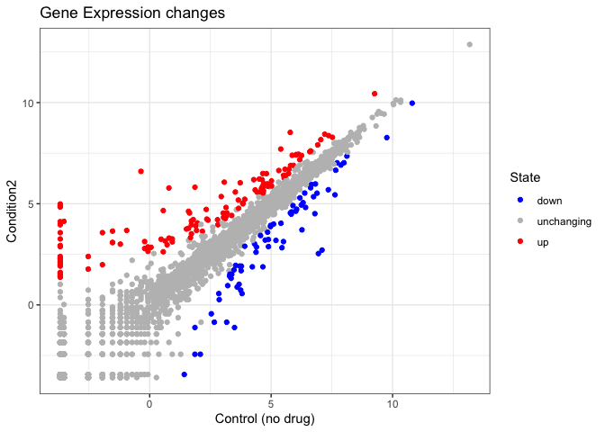

# Class 05: Data Visualization with GGPLOT
Gonzalez A16745338

# Week 4 Data Visualization Lab

# Install the package ggplot2

# install.packages(“ggplot2”)

# Anytime I want to use this package I need to load it

``` r
library(ggplot2)
#View(cars)
```

# A quick base R plot - this is not a ggplot2

``` r
plot(cars)
```


# Our first ggplot

# We need data + aes + geoms

``` r
ggplot(data=cars) +
  aes(x=speed, y=dist) +
  geom_point()
```


``` r
p <- ggplot(data=cars) +
      aes(x=speed, y=dist) +
      geom_point()
```

# Add a line geom with geom_line()

``` r
p + geom_line()
```


# Add a trend line close to the data

``` r
p + geom_smooth()
```

    `geom_smooth()` using method = 'loess' and formula = 'y ~ x'


``` r
p + geom_smooth(method= "lm")
```

    `geom_smooth()` using formula = 'y ~ x'


# Read in our drug expression data

``` r
url <- "https://bioboot.github.io/bimm143_S20/class-material/up_down_expression.txt"
genes <- read.delim(url)
head(genes)
```

            Gene Condition1 Condition2      State
    1      A4GNT -3.6808610 -3.4401355 unchanging
    2       AAAS  4.5479580  4.3864126 unchanging
    3      AASDH  3.7190695  3.4787276 unchanging
    4       AATF  5.0784720  5.0151916 unchanging
    5       AATK  0.4711421  0.5598642 unchanging
    6 AB015752.4 -3.6808610 -3.5921390 unchanging

# Q. How many genes are in this dataset

``` r
nrow(genes)
```

    [1] 5196

``` r
ncol(genes)
```

    [1] 4

# Q. how many ‘up’ regulated genes

``` r
table(genes$State)
```


          down unchanging         up 
            72       4997        127 

# Q. What fraction of genes is up-regulated

``` r
round((table(genes$State) / nrow(genes)) * 100, 2)
```


          down unchanging         up 
          1.39      96.17       2.44 

# Let’s make a first plot attempt

``` r
g <- ggplot(data=genes) +
      aes(x=Condition1, y=Condition2, col=State) +
      geom_point()
g
```


# Add some color

``` r
g + scale_color_manual(values=c("blue", "gray", "red")) +
  labs(title = "Gene Expression changes", 
  x ="Control (no drug)") +
  theme_bw()
```


