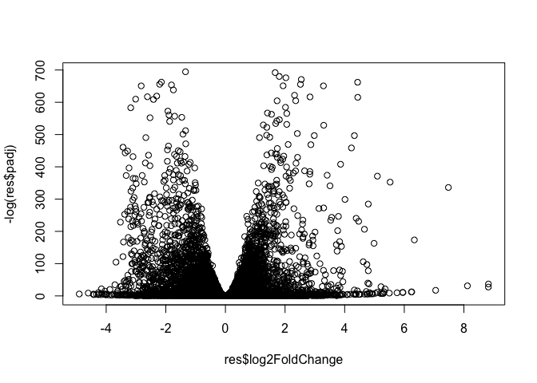

# class 14
Gonzalez A16745338

Today we will complete an RNASeq analysis from counts to pathways.

We will work with data on differential analysis of lung fibroblasts in
response to loss of developmental transciption factor HOXA1.

## Data Import

``` r
library(DESeq2)
```

    Loading required package: S4Vectors

    Loading required package: stats4

    Loading required package: BiocGenerics


    Attaching package: 'BiocGenerics'

    The following objects are masked from 'package:stats':

        IQR, mad, sd, var, xtabs

    The following objects are masked from 'package:base':

        anyDuplicated, aperm, append, as.data.frame, basename, cbind,
        colnames, dirname, do.call, duplicated, eval, evalq, Filter, Find,
        get, grep, grepl, intersect, is.unsorted, lapply, Map, mapply,
        match, mget, order, paste, pmax, pmax.int, pmin, pmin.int,
        Position, rank, rbind, Reduce, rownames, sapply, saveRDS, setdiff,
        table, tapply, union, unique, unsplit, which.max, which.min


    Attaching package: 'S4Vectors'

    The following object is masked from 'package:utils':

        findMatches

    The following objects are masked from 'package:base':

        expand.grid, I, unname

    Loading required package: IRanges

    Loading required package: GenomicRanges

    Loading required package: GenomeInfoDb

    Loading required package: SummarizedExperiment

    Loading required package: MatrixGenerics

    Loading required package: matrixStats


    Attaching package: 'MatrixGenerics'

    The following objects are masked from 'package:matrixStats':

        colAlls, colAnyNAs, colAnys, colAvgsPerRowSet, colCollapse,
        colCounts, colCummaxs, colCummins, colCumprods, colCumsums,
        colDiffs, colIQRDiffs, colIQRs, colLogSumExps, colMadDiffs,
        colMads, colMaxs, colMeans2, colMedians, colMins, colOrderStats,
        colProds, colQuantiles, colRanges, colRanks, colSdDiffs, colSds,
        colSums2, colTabulates, colVarDiffs, colVars, colWeightedMads,
        colWeightedMeans, colWeightedMedians, colWeightedSds,
        colWeightedVars, rowAlls, rowAnyNAs, rowAnys, rowAvgsPerColSet,
        rowCollapse, rowCounts, rowCummaxs, rowCummins, rowCumprods,
        rowCumsums, rowDiffs, rowIQRDiffs, rowIQRs, rowLogSumExps,
        rowMadDiffs, rowMads, rowMaxs, rowMeans2, rowMedians, rowMins,
        rowOrderStats, rowProds, rowQuantiles, rowRanges, rowRanks,
        rowSdDiffs, rowSds, rowSums2, rowTabulates, rowVarDiffs, rowVars,
        rowWeightedMads, rowWeightedMeans, rowWeightedMedians,
        rowWeightedSds, rowWeightedVars

    Loading required package: Biobase

    Welcome to Bioconductor

        Vignettes contain introductory material; view with
        'browseVignettes()'. To cite Bioconductor, see
        'citation("Biobase")', and for packages 'citation("pkgname")'.


    Attaching package: 'Biobase'

    The following object is masked from 'package:MatrixGenerics':

        rowMedians

    The following objects are masked from 'package:matrixStats':

        anyMissing, rowMedians

``` r
metaFile <- "GSE37704_metadata.csv"
countFile <- "GSE37704_featurecounts.csv"

# Import metadata and take a peak
metadata = read.csv(metaFile, row.names=1)
metadata$id <- row.names(metadata)
head(metadata)
```

                  condition        id
    SRR493366 control_sirna SRR493366
    SRR493367 control_sirna SRR493367
    SRR493368 control_sirna SRR493368
    SRR493369      hoxa1_kd SRR493369
    SRR493370      hoxa1_kd SRR493370
    SRR493371      hoxa1_kd SRR493371

``` r
# Import countdata
countData = read.csv(countFile, row.names=1)
head(countData)
```

                    length SRR493366 SRR493367 SRR493368 SRR493369 SRR493370
    ENSG00000186092    918         0         0         0         0         0
    ENSG00000279928    718         0         0         0         0         0
    ENSG00000279457   1982        23        28        29        29        28
    ENSG00000278566    939         0         0         0         0         0
    ENSG00000273547    939         0         0         0         0         0
    ENSG00000187634   3214       124       123       205       207       212
                    SRR493371
    ENSG00000186092         0
    ENSG00000279928         0
    ENSG00000279457        46
    ENSG00000278566         0
    ENSG00000273547         0
    ENSG00000187634       258

Check correspondence of the columns of ‘counts’ and rows of ‘metadata’

``` r
colnames(countData)
```

    [1] "length"    "SRR493366" "SRR493367" "SRR493368" "SRR493369" "SRR493370"
    [7] "SRR493371"

``` r
metadata$id
```

    [1] "SRR493366" "SRR493367" "SRR493368" "SRR493369" "SRR493370" "SRR493371"

We need to remove the first length column from our counts

``` r
counts <- countData[,-1]
colnames(counts) == metadata$id
```

    [1] TRUE TRUE TRUE TRUE TRUE TRUE

> Q. How many genes do we have?

``` r
nrow(counts)
```

    [1] 19808

There are tones of zero count genes that we can get rid of.

``` r
to.rm <- rowSums(counts) == 0
#counts[!to.rm,]
```

``` r
to.keep <- rowSums(counts) == !0
countData[to.keep,]
```

                    length SRR493366 SRR493367 SRR493368 SRR493369 SRR493370
    ENSG00000237330   1902         0         0         0         0         1
    ENSG00000173662   2892         0         0         1         0         0
    ENSG00000131686   2662         0         0         1         0         0
    ENSG00000277726   2205         0         0         1         0         0
    ENSG00000120952   1642         0         0         0         0         0
    ENSG00000277058   1148         0         0         0         0         1
    ENSG00000275774   1148         0         0         1         0         0
    ENSG00000162438   3486         0         0         0         0         1
    ENSG00000186510   3476         0         0         0         0         0
    ENSG00000187144   4506         0         0         0         1         0
    ENSG00000158748   1984         0         1         0         0         0
    ENSG00000162543   5571         0         0         0         0         0
    ENSG00000158816   6377         0         0         0         1         0
    ENSG00000070886   5358         0         0         0         0         0
    ENSG00000188822   5254         0         0         0         1         0
    ENSG00000131914   4008         0         0         0         0         1
    ENSG00000182866   3339         0         0         1         0         0
    ENSG00000188910   2387         0         0         0         0         1
    ENSG00000187513   1717         0         0         0         0         0
    ENSG00000271741   3099         0         0         0         0         0
    ENSG00000274944   3251         0         0         0         1         0
    ENSG00000204060   2398         0         0         0         0         0
    ENSG00000127129   1639         0         0         0         0         1
    ENSG00000177181   8981         0         0         0         0         0
    ENSG00000253313   1516         1         0         0         0         0
    ENSG00000142700   3225         0         0         0         0         0
    ENSG00000134709   6758         0         0         0         1         0
    ENSG00000177414   1838         0         1         0         0         0
    ENSG00000116783   4719         1         0         0         0         0
    ENSG00000137976   1476         0         0         1         0         0
    ENSG00000213512   2454         0         0         0         1         0
    ENSG00000134184   2512         0         0         1         0         0
    ENSG00000134256   3828         0         0         0         0         1
    ENSG00000271567    785         1         0         0         0         0
    ENSG00000265107   3292         1         0         0         0         0
    ENSG00000263464    600         0         1         0         0         0
    ENSG00000203852   1656         0         1         0         0         0
    ENSG00000143452   2405         0         0         0         1         0
    ENSG00000159409   4439         0         0         0         1         0
    ENSG00000143520   9124         0         1         0         0         0
    ENSG00000159455    612         0         1         0         0         0
    ENSG00000203786   2492         0         0         0         0         0
    ENSG00000240386    357         0         0         0         0         0
    ENSG00000169418   5003         0         0         1         0         0
    ENSG00000143595   2292         0         0         0         0         1
    ENSG00000163239   2706         0         0         0         1         0
    ENSG00000173080   1240         0         0         0         0         1
    ENSG00000132698   1699         0         0         0         0         0
    ENSG00000260238   1007         0         0         0         0         0
    ENSG00000242252   1190         0         1         0         0         0
    ENSG00000189030    676         0         1         0         0         0
    ENSG00000125462  12314         0         0         0         0         0
    ENSG00000198400   4356         0         0         0         0         0
    ENSG00000253831   1976         0         1         0         0         0
    ENSG00000163568   2009         0         0         1         0         0
    ENSG00000085552   6628         0         0         1         0         0
    ENSG00000177807   5293         0         0         0         0         0
    ENSG00000143194   3148         0         0         0         1         0
    ENSG00000198771   5718         0         0         0         0         1
    ENSG00000198734   7158         0         0         0         0         0
    ENSG00000180999   1725         0         1         0         0         0
    ENSG00000203737   1088         0         0         0         1         0
    ENSG00000198216  17771         0         0         0         1         0
    ENSG00000157060   2982         0         0         1         0         0
    ENSG00000173627   2653         0         1         0         0         0
    ENSG00000159166   3482         0         1         0         0         0
    ENSG00000163435   7191         0         0         0         0         0
    ENSG00000143851   5906         0         0         1         0         0
    ENSG00000133055   1805         0         0         1         0         0
    ENSG00000162896   4376         0         0         0         0         0
    ENSG00000123843   3219         0         0         1         0         0
    ENSG00000197721   2768         1         0         0         0         0
    ENSG00000198570   4266         1         0         0         0         0
    ENSG00000196660   5770         0         0         0         1         0
    ENSG00000116141   5417         0         0         0         0         1
    ENSG00000197520   2603         0         0         0         0         0
    ENSG00000186197   3726         0         1         0         0         0
    ENSG00000198626  17777         0         0         0         0         1
    ENSG00000180287   9545         0         0         0         0         1
    ENSG00000135747   3197         0         0         0         0         0
    ENSG00000169224   4680         0         0         0         0         1
    ENSG00000177462    939         1         0         0         0         0
    ENSG00000084674  14828         0         0         0         0         1
    ENSG00000280034    375         0         0         0         1         0
    ENSG00000189350  19816         1         0         0         0         0
    ENSG00000205221   3710         0         0         1         0         0
    ENSG00000170577   2205         0         0         0         0         0
    ENSG00000178021   3089         1         0         0         0         0
    ENSG00000163217   1584         0         0         0         1         0
    ENSG00000169605   1149         1         0         0         0         0
    ENSG00000135638   5516         0         1         0         0         0
    ENSG00000144035    947         0         0         0         0         0
    ENSG00000274049   2040         0         0         1         0         0
    ENSG00000214336   2804         0         0         0         0         0
    ENSG00000188886   1654         0         0         0         0         0
    ENSG00000279515    690         0         0         0         0         0
    ENSG00000256671   2553         0         0         0         0         1
    ENSG00000144130   4225         0         0         0         0         1
    ENSG00000136688   1380         0         0         0         1         0
    ENSG00000163064   2886         0         0         0         1         0
    ENSG00000144119   2043         0         0         0         0         0
    ENSG00000163075   9655         0         1         0         0         0
    ENSG00000281676     42         0         0         0         0         1
    ENSG00000054219   8798         0         0         0         0         0
    ENSG00000115290   2958         0         0         0         0         1
    ENSG00000204334    601         0         0         1         0         0
    ENSG00000175879   2629         1         0         0         0         0
    ENSG00000281192     72         0         0         0         0         1
    ENSG00000152430   4004         0         1         0         0         0
    ENSG00000144410   1209         0         0         0         1         0
    ENSG00000127831   6920         0         0         0         0         0
    ENSG00000135925   3412         0         0         0         0         1
    ENSG00000135903   4633         0         1         0         0         0
    ENSG00000144460   4828         0         0         0         0         1
    ENSG00000185038   5730         0         0         0         0         0
    ENSG00000178602    645         0         1         0         0         0
    ENSG00000172478   2772         0         0         0         0         0
    ENSG00000144550   2335         0         0         0         0         0
    ENSG00000183960   6148         0         0         0         0         0
    ENSG00000206557   8685         0         0         0         1         0
    ENSG00000183813   3095         0         0         0         0         0
    ENSG00000168329   3655         0         0         1         0         0
    ENSG00000157119   2517         0         1         0         0         0
    ENSG00000180432   4441         0         0         1         0         0
    ENSG00000163810   5443         0         0         0         0         0
    ENSG00000173578   5403         0         0         0         1         0
    ENSG00000012223   4247         0         0         1         0         0
    ENSG00000163825   1321         1         0         0         0         0
    ENSG00000241186   5013         0         0         0         1         0
    ENSG00000187492   3163         0         0         1         0         0
    ENSG00000179564   1494         0         0         0         0         1
    ENSG00000272104    408         0         1         0         0         0
    ENSG00000239732   3870         0         0         0         0         0
    ENSG00000010319   5011         0         1         0         0         0
    ENSG00000055955   5462         0         1         0         0         0
    ENSG00000186451   2413         0         0         0         1         0
    ENSG00000064835   1569         0         0         0         0         1
    ENSG00000235156    668         1         0         0         0         0
    ENSG00000163530   1383         1         0         0         0         0
    ENSG00000144837   2202         0         0         0         1         0
    ENSG00000145103   2953         0         0         1         0         0
    ENSG00000189366    843         0         1         0         0         0
    ENSG00000180767   1789         0         0         1         0         0
    ENSG00000163914   2592         0         0         0         0         0
    ENSG00000170893   1978         0         0         0         0         1
    ENSG00000169313   1859         0         1         0         0         0
    ENSG00000188306   1827         1         0         0         0         0
    ENSG00000197584   3542         1         0         0         0         0
    ENSG00000181449   2513         0         0         0         0         0
    ENSG00000172578  10546         0         0         0         0         1
    ENSG00000145192   2353         0         1         0         0         0
    ENSG00000181092   4613         0         0         0         1         0
    ENSG00000145107   1899         0         0         0         0         0
    ENSG00000109684   6206         1         0         0         0         0
    ENSG00000137440   1359         0         0         0         1         0
    ENSG00000137441   1250         0         0         1         0         0
    ENSG00000177752   1813         0         0         0         0         0
    ENSG00000109255    975         0         0         0         1         0
    ENSG00000087128   2138         0         0         0         0         1
    ENSG00000156096   2489         0         0         0         0         0
    ENSG00000171209    836         1         0         0         0         0
    ENSG00000171195   2798         0         0         0         0         1
    ENSG00000056291   2359         0         0         0         0         0
    ENSG00000163737    604         0         0         0         0         0
    ENSG00000152208   7508         0         0         0         1         0
    ENSG00000198099   2453         0         0         0         0         1
    ENSG00000248144   1860         1         0         0         0         0
    ENSG00000168743   6117         0         0         0         0         1
    ENSG00000109471   1119         0         0         0         0         0
    ENSG00000151475   1841         1         0         0         0         0
    ENSG00000145423   2032         0         0         0         1         0
    ENSG00000121207   7562         0         0         1         0         0
    ENSG00000256394   1692         0         1         0         0         0
    ENSG00000168843   5355         0         0         0         1         0
    ENSG00000185758    663         1         0         0         0         0
    ENSG00000088926   3364         0         0         0         1         0
    ENSG00000205097   2103         0         1         0         0         0
    ENSG00000185028   1573         0         0         0         0         0
    ENSG00000281325   1802         0         0         0         1         0
    ENSG00000113100   4203         0         0         1         0         0
    ENSG00000273294   3424         0         1         0         0         0
    ENSG00000082074   6100         0         0         0         0         0
    ENSG00000016082   2882         0         1         0         0         0
    ENSG00000164287   4496         1         0         0         0         0
    ENSG00000280447    375         0         0         0         1         0
    ENSG00000134061   5668         1         0         0         0         0
    ENSG00000122012  12028         0         0         0         0         0
    ENSG00000145692   3519         1         0         0         0         0
    ENSG00000145721   4115         0         0         0         0         1
    ENSG00000145794   9007         0         0         0         0         1
    ENSG00000186367   2354         0         0         0         0         1
    ENSG00000239642   1671         0         0         1         0         0
    ENSG00000113520    818         0         1         0         0         0
    ENSG00000205089   3162         0         0         1         0         0
    ENSG00000198944   3211         1         0         0         0         0
    ENSG00000145826   2175         1         0         0         0         0
    ENSG00000061492   2089         0         0         0         0         0
    ENSG00000281227     48         0         0         0         0         0
    ENSG00000204965   7114         0         0         0         0         0
    ENSG00000251664   5454         0         0         0         0         0
    ENSG00000120329   1417         1         0         0         0         0
    ENSG00000275740   3311         0         0         0         0         1
    ENSG00000091010   1182         1         0         0         0         0
    ENSG00000132915   7415         0         0         0         0         0
    ENSG00000279109     69         1         0         0         0         0
    ENSG00000186335   4263         0         0         0         0         0
    ENSG00000145888   2434         0         0         0         1         0
    ENSG00000113302   2761         0         0         1         0         0
    ENSG00000182132   3126         0         0         0         1         0
    ENSG00000113749   2565         0         0         0         0         0
    ENSG00000170074   8528         0         0         0         0         1
    ENSG00000204677   4285         0         0         0         0         1
    ENSG00000164304   3512         0         0         1         0         0
    ENSG00000259040   3302         0         0         0         1         0
    ENSG00000181355   4807         0         0         0         1         0
    ENSG00000153157   3962         1         0         0         0         0
    ENSG00000278705    438         0         0         1         0         0
    ENSG00000124557   2895         1         0         0         0         0
    ENSG00000274997    387         0         1         0         0         0
    ENSG00000158553   3354         1         0         0         0         0
    ENSG00000273703    381         1         0         0         0         0
    ENSG00000275126    312         0         0         0         0         1
    ENSG00000204657   1584         0         0         1         0         0
    ENSG00000204539   2552         0         0         1         0         0
    ENSG00000226979   1737         0         0         0         0         0
    ENSG00000232810   1676         0         0         0         1         0
    ENSG00000227507   1535         0         0         0         1         0
    ENSG00000204475   1212         0         0         1         0         0
    ENSG00000204287   1280         0         0         0         0         0
    ENSG00000250264   2705         0         0         0         1         0
    ENSG00000231389   5748         0         0         0         0         0
    ENSG00000270800    876         0         0         0         0         0
    ENSG00000197753   2961         0         0         0         0         0
    ENSG00000180316   2567         0         1         0         0         0
    ENSG00000124721  15055         0         1         0         0         0
    ENSG00000164626   3756         0         0         1         0         0
    ENSG00000124701   1151         0         0         0         0         0
    ENSG00000171611   1168         0         0         0         1         0
    ENSG00000146215   2453         1         0         0         0         0
    ENSG00000181577   3917         0         0         0         0         0
    ENSG00000137225   3549         0         0         0         0         0
    ENSG00000112782   8997         0         0         0         0         1
    ENSG00000112796   4264         0         1         0         0         0
    ENSG00000170950   1254         0         0         1         0         0
    ENSG00000168143   3167         0         1         0         0         0
    ENSG00000243501   1636         0         1         0         0         0
    ENSG00000256980    953         0         0         0         1         0
    ENSG00000272514   3613         1         0         0         0         0
    ENSG00000118432   6357         0         0         0         0         0
    ENSG00000186231   4124         0         1         0         0         0
    ENSG00000152034   2392         0         0         0         0         1
    ENSG00000112246   9274         0         0         0         0         0
    ENSG00000187772   5505         0         0         0         1         0
    ENSG00000004809   3907         0         0         0         0         1
    ENSG00000182747   2359         0         0         0         1         0
    ENSG00000257065    762         0         0         0         1         0
    ENSG00000074771   2042         0         1         0         0         0
    ENSG00000112530   2612         1         0         0         0         0
    ENSG00000112539   2240         0         0         1         0         0
    ENSG00000187546   3587         0         0         0         0         0
    ENSG00000106511   2500         0         0         0         0         1
    ENSG00000171243   2473         0         1         0         0         0
    ENSG00000229937   1090         0         0         0         0         0
    ENSG00000281889    123         0         0         0         1         0
    ENSG00000196335   6183         0         0         0         1         0
    ENSG00000106069  10660         0         0         0         0         0
    ENSG00000122574   6065         0         0         0         0         1
    ENSG00000106631   1458         0         0         1         0         0
    ENSG00000164746   2275         0         0         0         0         1
    ENSG00000158517   3462         1         0         0         0         0
    ENSG00000243566   2660         0         0         0         0         1
    ENSG00000185040   3611         0         1         0         0         0
    ENSG00000160868   3141         0         0         0         0         1
    ENSG00000021461   2637         0         0         0         0         1
    ENSG00000077080   2389         1         0         0         0         0
    ENSG00000106436   1009         0         0         0         0         0
    ENSG00000187416   1900         0         1         0         0         0
    ENSG00000172209   3683         1         0         0         0         0
    ENSG00000281656     48         0         0         0         1         0
    ENSG00000106328   3214         1         0         0         0         0
    ENSG00000227471   3325         0         0         0         0         0
    ENSG00000214102   3061         1         0         0         0         0
    ENSG00000197993   3923         0         1         0         0         0
    ENSG00000106526   6460         0         0         0         1         0
    ENSG00000171115   4184         0         0         0         0         1
    ENSG00000185960   4384         0         0         0         0         0
    ENSG00000198223   3830         0         0         0         1         0
    ENSG00000196433   1846         1         0         0         0         0
    ENSG00000130234   3926         0         0         1         0         0
    ENSG00000169906    455         0         0         0         0         0
    ENSG00000147036  10298         0         0         1         0         0
    ENSG00000279849    375         0         1         0         0         0
    ENSG00000147113   6720         1         0         0         0         0
    ENSG00000130988   2811         1         0         0         0         0
    ENSG00000165583   1668         0         1         0         0         0
    ENSG00000158578   2134         0         0         0         0         1
    ENSG00000238269    507         0         0         0         1         0
    ENSG00000050030  11757         0         0         0         0         0
    ENSG00000078596   2051         0         0         0         1         0
    ENSG00000184905   1666         0         0         1         0         0
    ENSG00000204065   1168         0         0         0         1         0
    ENSG00000188828   2722         0         1         0         0         0
    ENSG00000123576   1495         1         0         0         0         0
    ENSG00000147223   1190         0         0         0         1         0
    ENSG00000198088   1867         0         0         0         0         0
    ENSG00000101890   3714         0         0         0         0         0
    ENSG00000183918   2450         0         0         0         0         1
    ENSG00000147255   6818         0         0         0         0         0
    ENSG00000147257   2711         0         0         0         0         0
    ENSG00000227234    469         0         0         0         0         0
    ENSG00000267978   1921         0         0         1         0         0
    ENSG00000171116   1963         0         0         0         1         0
    ENSG00000123584   1814         0         0         0         1         0
    ENSG00000156009   2363         0         1         0         0         0
    ENSG00000183837   3748         0         0         0         0         1
    ENSG00000130829   2776         0         0         0         0         0
    ENSG00000203870   1225         0         0         1         0         0
    ENSG00000223443   1910         0         0         0         1         0
    ENSG00000168546   5716         1         0         0         0         0
    ENSG00000248235   1198         0         0         0         0         0
    ENSG00000015592   3294         0         0         1         0         0
    ENSG00000189233   3959         0         1         0         0         0
    ENSG00000214050   3972         0         1         0         0         0
    ENSG00000188778   2950         1         0         0         0         0
    ENSG00000196166   2250         0         1         0         0         0
    ENSG00000104371    894         0         0         0         0         0
    ENSG00000104237   7100         0         0         0         1         0
    ENSG00000172817   2282         0         0         1         0         0
    ENSG00000261787   2589         0         0         0         1         0
    ENSG00000076554   8197         0         0         0         1         0
    ENSG00000147606   6273         0         0         0         0         1
    ENSG00000174226   3149         0         0         0         0         0
    ENSG00000147647   3818         0         0         0         0         0
    ENSG00000212993   5360         0         1         0         0         0
    ENSG00000254402   1772         0         0         1         0         0
    ENSG00000183784   2918         0         0         0         1         0
    ENSG00000205549    454         0         0         1         0         0
    ENSG00000107105   5140         0         0         0         0         0
    ENSG00000165269   5253         0         0         0         0         0
    ENSG00000256966   3217         1         0         0         0         0
    ENSG00000070601   5867         0         1         0         0         0
    ENSG00000183148   3954         0         1         0         0         0
    ENSG00000273514   2034         0         1         0         0         0
    ENSG00000107242   4918         0         0         0         0         1
    ENSG00000119125   7904         0         1         0         0         0
    ENSG00000165023   4385         0         0         0         0         1
    ENSG00000148123   3669         0         0         0         0         0
    ENSG00000188386   3387         0         0         0         1         0
    ENSG00000229314    901         0         1         0         0         0
    ENSG00000228278    760         0         0         0         1         0
    ENSG00000165702   2872         0         0         1         0         0
    ENSG00000107147  11656         0         0         0         0         1
    ENSG00000180549   2584         0         0         1         0         0
    ENSG00000184709   1209         0         0         0         1         0
    ENSG00000197768   1611         0         1         0         0         0
    ENSG00000278919   2175         0         0         0         0         1
    ENSG00000180176   3243         0         0         0         0         1
    ENSG00000184698    981         0         1         0         0         0
    ENSG00000180919   1152         0         0         0         0         1
    ENSG00000265264    884         0         0         1         0         0
    ENSG00000170790   1053         0         0         0         1         0
    ENSG00000170782    995         0         0         0         0         0
    ENSG00000170683   1061         0         0         1         0         0
    ENSG00000166405   7657         0         0         0         0         1
    ENSG00000166407   1690         0         0         0         1         0
    ENSG00000133800   3515         0         0         0         0         1
    ENSG00000006611   4904         0         1         0         0         0
    ENSG00000179817   1655         0         0         1         0         0
    ENSG00000173432    765         0         0         0         0         0
    ENSG00000110786   5497         0         0         0         0         1
    ENSG00000255359    917         0         1         0         0         0
    ENSG00000148942   7544         1         0         0         0         0
    ENSG00000052850   5750         0         0         0         0         1
    ENSG00000066336   2069         0         0         0         0         1
    ENSG00000196666   1388         0         0         0         1         0
    ENSG00000134817   3738         0         0         0         1         0
    ENSG00000254462    585         0         0         1         0         0
    ENSG00000186509   2488         0         0         0         0         0
    ENSG00000214787   1558         0         0         0         0         0
    ENSG00000156738   4872         0         0         0         1         0
    ENSG00000110448   3221         1         0         0         0         0
    ENSG00000133328    742         0         1         0         0         0
    ENSG00000219435   1035         0         0         0         1         0
    ENSG00000273003   2392         1         0         0         0         0
    ENSG00000204710    991         0         0         0         0         0
    ENSG00000173237   1187         0         0         1         0         0
    ENSG00000256514    711         0         0         1         0         0
    ENSG00000204571   1523         0         0         1         0         0
    ENSG00000182103   3924         0         0         0         1         0
    ENSG00000077498   3016         0         1         0         0         0
    ENSG00000255501    940         0         0         0         0         1
    ENSG00000170290    906         0         0         1         0         0
    ENSG00000110777   7416         0         0         0         0         1
    ENSG00000255292   1190         0         1         0         0         0
    ENSG00000149295   4098         0         0         0         1         0
    ENSG00000255663    729         0         0         0         0         0
    ENSG00000137634   2163         0         0         0         0         1
    ENSG00000110324   6548         0         0         0         0         0
    ENSG00000176302   1237         0         1         0         0         0
    ENSG00000137709   6645         0         0         1         0         0
    ENSG00000149418   4350         0         0         1         0         0
    ENSG00000166105   8945         0         0         0         1         0
    ENSG00000282246   2179         0         0         0         1         0
    ENSG00000148482   2808         1         0         0         0         0
    ENSG00000078114  13654         0         0         0         0         1
    ENSG00000077327   3887         0         0         0         0         0
    ENSG00000263639    492         0         1         0         0         0
    ENSG00000204175   1968         0         1         0         0         0
    ENSG00000243251   2212         1         0         0         0         0
    ENSG00000165443   4093         0         0         0         0         0
    ENSG00000227877   2941         1         0         0         0         0
    ENSG00000107736  18059         0         1         0         0         0
    ENSG00000138308   1128         0         1         0         0         0
    ENSG00000185303   2685         0         1         0         0         0
    ENSG00000133661   1321         0         1         0         0         0
    ENSG00000185737   5072         0         0         0         0         0
    ENSG00000204022   4528         1         0         0         0         0
    ENSG00000138136   2900         0         0         0         1         0
    ENSG00000107831   1403         0         0         0         0         0
    ENSG00000148795   3386         0         0         0         0         0
    ENSG00000185933   3053         0         0         1         0         0
    ENSG00000254536   1605         0         0         0         1         0
    ENSG00000111704   5393         0         1         0         0         0
    ENSG00000150045   1260         1         0         0         0         0
    ENSG00000213809   3030         0         0         0         0         1
    ENSG00000212128   1637         0         0         0         0         0
    ENSG00000256188   1831         0         0         0         0         1
    ENSG00000121335   1793         0         0         0         0         0
    ENSG00000273079  30672         0         0         1         0         0
    ENSG00000151490   7519         0         0         1         0         0
    ENSG00000111404   1549         0         1         0         0         0
    ENSG00000177359   5471         0         0         0         0         1
    ENSG00000185610   2806         0         0         1         0         0
    ENSG00000139223    960         0         1         0         0         0
    ENSG00000197376   3097         0         1         0         0         0
    ENSG00000139549   1936         0         0         1         0         0
    ENSG00000135406   4353         1         0         0         0         0
    ENSG00000086159   5129         0         1         0         0         0
    ENSG00000123388   3265         0         0         0         1         0
    ENSG00000139572   2043         0         0         1         0         0
    ENSG00000172551   1250         0         1         0         0         0
    ENSG00000257390   2534         0         1         0         0         0
    ENSG00000139540   2903         1         0         0         0         0
    ENSG00000175336   1715         0         0         1         0         0
    ENSG00000166856   3451         0         0         0         0         0
    ENSG00000166866   4438         0         0         1         0         0
    ENSG00000166148   5963         1         0         0         0         0
    ENSG00000185306   5504         1         0         0         0         0
    ENSG00000156076   2368         0         0         0         0         1
    ENSG00000090382   1764         0         1         0         0         0
    ENSG00000180318   1445         0         0         0         0         1
    ENSG00000182050  27763         0         0         0         1         0
    ENSG00000197651   3244         0         0         0         0         0
    ENSG00000083782   1805         0         0         1         0         0
    ENSG00000183395    766         0         0         0         0         1
    ENSG00000111783   6783         0         0         0         1         0
    ENSG00000089116   3125         0         0         0         1         0
    ENSG00000089250  13113         0         0         0         0         0
    ENSG00000170890    638         1         0         0         0         0
    ENSG00000120669   3399         0         0         0         0         0
    ENSG00000250709   2051         0         1         0         0         0
    ENSG00000080618   1767         0         0         1         0         0
    ENSG00000152207   5372         0         0         0         1         0
    ENSG00000152192   4547         0         0         0         0         0
    ENSG00000134873   3380         0         0         0         0         0
    ENSG00000182968   2842         0         1         0         0         0
    ENSG00000176198   1082         0         0         1         0         0
    ENSG00000165799   1499         0         0         0         1         0
    ENSG00000255804   1044         0         0         0         1         0
    ENSG00000259522   4351         0         0         0         0         0
    ENSG00000129467   8067         0         0         0         0         1
    ENSG00000092009    937         0         0         1         0         0
    ENSG00000100453   1411         0         0         0         1         0
    ENSG00000165496    812         0         0         1         0         0
    ENSG00000258644   1404         1         0         0         0         0
    ENSG00000182732   8937         0         1         0         0         0
    ENSG00000279461    409         0         1         0         0         0
    ENSG00000165548   6363         0         0         1         0         0
    ENSG00000280308    375         0         0         0         0         0
    ENSG00000197734    704         0         0         0         1         0
    ENSG00000165409   5519         0         0         0         1         0
    ENSG00000170099   1852         0         0         0         0         1
    ENSG00000133937   1264         0         0         0         0         1
    ENSG00000140107   1799         0         0         1         0         0
    ENSG00000156414   5480         0         0         0         0         1
    ENSG00000213145   2485         0         0         1         0         0
    ENSG00000261739   4349         0         1         0         0         0
    ENSG00000261247   2062         0         1         0         0         0
    ENSG00000134160   7454         0         1         0         0         0
    ENSG00000249931   3231         0         0         1         0         0
    ENSG00000184507   4196         1         0         0         0         0
    ENSG00000255192    918         0         1         0         0         0
    ENSG00000175779   2043         0         0         0         0         0
    ENSG00000137843   6457         0         0         0         0         1
    ENSG00000233041    941         0         0         0         0         0
    ENSG00000159337   5138         0         0         0         0         1
    ENSG00000223572   3109         0         0         0         0         1
    ENSG00000074803  12476         0         0         0         0         0
    ENSG00000170236   1907         0         1         0         0         0
    ENSG00000103569   3235         0         0         0         0         1
    ENSG00000171989   1693         0         0         0         0         0
    ENSG00000205502   1579         0         0         0         0         0
    ENSG00000259316   2732         0         1         0         0         0
    ENSG00000183324    927         0         0         0         0         1
    ENSG00000080644   4765         0         0         1         0         0
    ENSG00000260836    880         1         0         0         0         0
    ENSG00000250021   2673         0         0         1         0         0
    ENSG00000140557   5903         0         0         0         0         1
    ENSG00000183571   1576         0         0         0         0         0
    ENSG00000127588    984         1         0         0         0         0
    ENSG00000167945   1209         0         0         0         1         0
    ENSG00000103355   2112         0         0         0         1         0
    ENSG00000213937   2050         0         1         0         0         0
    ENSG00000130182   3319         0         0         1         0         0
    ENSG00000103313   4819         0         1         0         0         0
    ENSG00000224712   2188         0         1         0         0         0
    ENSG00000134398   4998         0         0         0         0         0
    ENSG00000233232   1493         0         0         0         0         1
    ENSG00000052344   3010         0         0         0         0         0
    ENSG00000140798   7456         0         0         1         0         0
    ENSG00000102924   2594         0         1         0         0         0
    ENSG00000102970    620         0         0         1         0         0
    ENSG00000070729   7298         0         0         0         0         1
    ENSG00000159723    764         0         0         1         0         0
    ENSG00000260914   1284         0         1         0         0         0
    ENSG00000157335   4894         0         0         0         0         1
    ENSG00000280252    381         0         0         1         0         0
    ENSG00000260537    887         0         0         1         0         0
    ENSG00000140835   2669         0         0         1         0         0
    ENSG00000280264    375         0         0         0         0         1
    ENSG00000103089   3279         0         0         0         0         0
    ENSG00000135702   3322         1         0         0         0         0
    ENSG00000168589   1464         0         0         0         0         1
    ENSG00000168418   6553         0         0         0         0         0
    ENSG00000129993   5972         0         0         0         0         1
    ENSG00000126856   4104         1         0         0         0         0
    ENSG00000180090    966         0         0         0         1         0
    ENSG00000108381   5854         1         0         0         0         0
    ENSG00000262304   7400         0         0         0         1         0
    ENSG00000108405   3970         1         0         0         0         0
    ENSG00000167741   3161         0         0         0         1         0
    ENSG00000182896   1224         0         0         0         0         0
    ENSG00000281523     48         0         0         0         0         0
    ENSG00000179593   3028         0         1         0         0         0
    ENSG00000125414   6623         0         0         0         0         1
    ENSG00000189375   3747         0         0         0         1         0
    ENSG00000171931   4390         0         1         0         0         0
    ENSG00000154016   3107         0         0         0         0         0
    ENSG00000142494   5719         0         0         0         0         1
    ENSG00000108255    794         0         0         0         0         1
    ENSG00000181374    851         0         1         0         0         0
    ENSG00000270806   1063         0         0         0         1         0
    ENSG00000270379   2930         0         1         0         0         0
    ENSG00000277363  11658         0         0         0         1         0
    ENSG00000275489    632         0         0         0         0         0
    ENSG00000204952   2302         0         0         1         0         0
    ENSG00000161405  10008         0         0         0         1         0
    ENSG00000171431   1846         0         0         0         1         0
    ENSG00000006059   1287         0         0         0         0         1
    ENSG00000108417   1475         1         0         0         0         0
    ENSG00000108759   1750         0         0         1         0         0
    ENSG00000186847   2281         0         0         0         0         1
    ENSG00000184502    470         0         0         0         0         1
    ENSG00000161610    577         0         0         1         0         0
    ENSG00000161649   4745         0         0         0         1         0
    ENSG00000179673   1093         0         0         0         0         0
    ENSG00000170703   5097         1         0         0         0         0
    ENSG00000108813   3644         0         0         0         0         0
    ENSG00000049283   4642         0         0         0         0         1
    ENSG00000153930   6923         1         0         0         0         0
    ENSG00000121053   2708         0         0         0         0         0
    ENSG00000005381   3526         1         0         0         0         0
    ENSG00000007312   2080         0         0         0         0         0
    ENSG00000007314   8247         0         1         0         0         0
    ENSG00000091583   1332         0         1         0         0         0
    ENSG00000204347   1805         0         1         0         0         0
    ENSG00000257008   1608         0         1         0         0         0
    ENSG00000167850   1517         0         0         1         0         0
    ENSG00000186407   3752         0         1         0         0         0
    ENSG00000182040   3558         0         0         1         0         0
    ENSG00000259120   1086         1         0         0         0         0
    ENSG00000257949   1303         1         0         0         0         0
    ENSG00000167880   7510         0         0         0         1         0
    ENSG00000185332   3794         0         0         0         0         1
    ENSG00000182459   1936         0         0         1         0         0
    ENSG00000141579   3713         1         0         0         0         0
    ENSG00000079101   3846         0         1         0         0         0
    ENSG00000185231   3734         0         0         0         0         0
    ENSG00000134755  12371         0         0         0         0         1
    ENSG00000101746   5687         0         0         0         1         0
    ENSG00000101489   6532         0         0         1         0         0
    ENSG00000206181   3050         0         0         1         0         0
    ENSG00000267699   1305         0         0         0         0         1
    ENSG00000141655   8993         1         0         0         0         0
    ENSG00000166573  10299         0         0         0         0         0
    ENSG00000256463   7397         0         0         0         1         0
    ENSG00000198326   3892         0         0         0         1         0
    ENSG00000088827   7886         0         0         0         0         0
    ENSG00000172264  11344         0         0         0         0         0
    ENSG00000101441    751         1         0         0         0         0
    ENSG00000149435   1279         1         0         0         0         0
    ENSG00000077984    930         0         0         0         1         0
    ENSG00000260903   7844         0         0         0         0         1
    ENSG00000254806   1402         0         0         1         0         0
    ENSG00000182931    630         0         0         1         0         0
    ENSG00000168634   1372         0         1         0         0         0
    ENSG00000101180   2671         0         0         0         0         0
    ENSG00000101197   1562         0         0         0         0         1
    ENSG00000185198   1090         0         0         0         1         0
    ENSG00000077009   1141         0         0         1         0         0
    ENSG00000105251   2811         0         0         0         0         1
    ENSG00000105428   1426         1         0         0         0         0
    ENSG00000267157    581         0         0         0         1         0
    ENSG00000171124   3109         1         0         0         0         0
    ENSG00000267314    580         0         0         0         1         0
    ENSG00000267952    634         0         0         0         0         1
    ENSG00000188000   3224         0         0         0         0         0
    ENSG00000267303   1850         0         1         0         0         0
    ENSG00000076662   2950         0         1         0         0         0
    ENSG00000130167   1561         0         0         0         0         0
    ENSG00000196361   4761         0         0         0         0         1
    ENSG00000213297   3639         0         0         0         1         0
    ENSG00000188032   1540         0         0         0         1         0
    ENSG00000105143   7646         0         0         0         1         0
    ENSG00000186529   5860         0         0         0         0         1
    ENSG00000186115   3142         0         0         0         0         1
    ENSG00000171903   4027         0         0         1         0         0
    ENSG00000196684   3398         1         0         0         0         0
    ENSG00000268790   1184         0         0         0         0         1
    ENSG00000105641   3652         0         0         0         1         0
    ENSG00000268173   5142         0         0         0         1         0
    ENSG00000269067   2192         0         0         0         0         1
    ENSG00000021488   2597         0         0         0         0         1
    ENSG00000089356   3334         0         0         0         0         0
    ENSG00000266964   1926         0         0         1         0         0
    ENSG00000105679   1519         0         0         0         0         1
    ENSG00000188223   1037         0         0         0         0         0
    ENSG00000105261    747         0         0         0         1         0
    ENSG00000171777   4183         0         0         0         0         0
    ENSG00000182472   5966         0         0         1         0         0
    ENSG00000171747   2645         0         0         1         0         0
    ENSG00000262484   1057         0         0         0         0         0
    ENSG00000188505   1978         0         0         0         0         1
    ENSG00000198077   2583         0         0         1         0         0
    ENSG00000221826   3486         0         0         0         0         0
    ENSG00000124467   4090         1         0         0         0         0
    ENSG00000237452   2749         0         0         1         0         0
    ENSG00000268434    859         0         0         0         0         1
    ENSG00000104941   2547         0         0         0         1         0
    ENSG00000170608   2192         1         0         0         0         0
    ENSG00000008438    720         0         0         1         0         0
    ENSG00000204866   2426         0         1         0         0         0
    ENSG00000118156   4655         0         0         1         0         0
    ENSG00000177202    972         0         0         0         0         0
    ENSG00000189052    841         0         0         1         0         0
    ENSG00000261949   1876         0         0         0         1         0
    ENSG00000126467   2391         0         0         1         0         0
    ENSG00000269404   4281         0         1         0         0         0
    ENSG00000086967   3708         0         1         0         0         0
    ENSG00000167755   1976         0         0         1         0         0
    ENSG00000167759   2007         0         0         0         1         0
    ENSG00000129437   1159         0         1         0         0         0
    ENSG00000269403    551         0         0         1         0         0
    ENSG00000198633   3279         0         0         1         0         0
    ENSG00000268964   2431         0         1         0         0         0
    ENSG00000129991   2034         0         1         0         0         0
    ENSG00000180043   3274         0         0         0         0         1
    ENSG00000185792   3599         0         0         0         1         0
    ENSG00000223638   1035         0         0         1         0         0
    ENSG00000160505   3903         1         0         0         0         0
    ENSG00000197213   2059         0         0         0         0         0
    ENSG00000092377   2407         0         0         0         1         0
    ENSG00000154620   1669         0         1         0         0         0
    ENSG00000279115    406         0         0         1         0         0
    ENSG00000099960   2447         1         0         0         0         0
    ENSG00000128322    904         0         0         0         1         0
    ENSG00000128218    610         0         0         1         0         0
    ENSG00000100122   1102         0         0         1         0         0
    ENSG00000196431    811         1         0         0         0         0
    ENSG00000099985   2114         0         0         0         0         0
    ENSG00000128253   2718         0         0         0         1         0
    ENSG00000128310   1157         1         0         0         0         0
    ENSG00000128383   2358         0         0         1         0         0
    ENSG00000100346  10792         0         0         0         0         0
    ENSG00000188263   3696         0         0         0         0         1
    ENSG00000217442    475         0         0         0         0         1
    ENSG00000100312   2059         0         1         0         0         0
    ENSG00000185272   2360         0         0         1         0         0
    ENSG00000155307   3169         0         0         0         0         0
    ENSG00000205929   4122         1         0         0         0         0
    ENSG00000159197   1051         1         0         0         0         0
    ENSG00000157554   7588         0         0         1         0         0
    ENSG00000183421   4033         0         0         0         0         0
    ENSG00000278704   2237         1         0         0         0         0
    ENSG00000277400   2179         0         0         1         0         0
                    SRR493371
    ENSG00000237330         0
    ENSG00000173662         0
    ENSG00000131686         0
    ENSG00000277726         0
    ENSG00000120952         1
    ENSG00000277058         0
    ENSG00000275774         0
    ENSG00000162438         0
    ENSG00000186510         1
    ENSG00000187144         0
    ENSG00000158748         0
    ENSG00000162543         1
    ENSG00000158816         0
    ENSG00000070886         1
    ENSG00000188822         0
    ENSG00000131914         0
    ENSG00000182866         0
    ENSG00000188910         0
    ENSG00000187513         1
    ENSG00000271741         1
    ENSG00000274944         0
    ENSG00000204060         1
    ENSG00000127129         0
    ENSG00000177181         1
    ENSG00000253313         0
    ENSG00000142700         1
    ENSG00000134709         0
    ENSG00000177414         0
    ENSG00000116783         0
    ENSG00000137976         0
    ENSG00000213512         0
    ENSG00000134184         0
    ENSG00000134256         0
    ENSG00000271567         0
    ENSG00000265107         0
    ENSG00000263464         0
    ENSG00000203852         0
    ENSG00000143452         0
    ENSG00000159409         0
    ENSG00000143520         0
    ENSG00000159455         0
    ENSG00000203786         1
    ENSG00000240386         1
    ENSG00000169418         0
    ENSG00000143595         0
    ENSG00000163239         0
    ENSG00000173080         0
    ENSG00000132698         1
    ENSG00000260238         1
    ENSG00000242252         0
    ENSG00000189030         0
    ENSG00000125462         1
    ENSG00000198400         1
    ENSG00000253831         0
    ENSG00000163568         0
    ENSG00000085552         0
    ENSG00000177807         1
    ENSG00000143194         0
    ENSG00000198771         0
    ENSG00000198734         1
    ENSG00000180999         0
    ENSG00000203737         0
    ENSG00000198216         0
    ENSG00000157060         0
    ENSG00000173627         0
    ENSG00000159166         0
    ENSG00000163435         1
    ENSG00000143851         0
    ENSG00000133055         0
    ENSG00000162896         1
    ENSG00000123843         0
    ENSG00000197721         0
    ENSG00000198570         0
    ENSG00000196660         0
    ENSG00000116141         0
    ENSG00000197520         1
    ENSG00000186197         0
    ENSG00000198626         0
    ENSG00000180287         0
    ENSG00000135747         1
    ENSG00000169224         0
    ENSG00000177462         0
    ENSG00000084674         0
    ENSG00000280034         0
    ENSG00000189350         0
    ENSG00000205221         0
    ENSG00000170577         1
    ENSG00000178021         0
    ENSG00000163217         0
    ENSG00000169605         0
    ENSG00000135638         0
    ENSG00000144035         1
    ENSG00000274049         0
    ENSG00000214336         1
    ENSG00000188886         1
    ENSG00000279515         1
    ENSG00000256671         0
    ENSG00000144130         0
    ENSG00000136688         0
    ENSG00000163064         0
    ENSG00000144119         1
    ENSG00000163075         0
    ENSG00000281676         0
    ENSG00000054219         1
    ENSG00000115290         0
    ENSG00000204334         0
    ENSG00000175879         0
    ENSG00000281192         0
    ENSG00000152430         0
    ENSG00000144410         0
    ENSG00000127831         1
    ENSG00000135925         0
    ENSG00000135903         0
    ENSG00000144460         0
    ENSG00000185038         1
    ENSG00000178602         0
    ENSG00000172478         1
    ENSG00000144550         1
    ENSG00000183960         1
    ENSG00000206557         0
    ENSG00000183813         1
    ENSG00000168329         0
    ENSG00000157119         0
    ENSG00000180432         0
    ENSG00000163810         1
    ENSG00000173578         0
    ENSG00000012223         0
    ENSG00000163825         0
    ENSG00000241186         0
    ENSG00000187492         0
    ENSG00000179564         0
    ENSG00000272104         0
    ENSG00000239732         1
    ENSG00000010319         0
    ENSG00000055955         0
    ENSG00000186451         0
    ENSG00000064835         0
    ENSG00000235156         0
    ENSG00000163530         0
    ENSG00000144837         0
    ENSG00000145103         0
    ENSG00000189366         0
    ENSG00000180767         0
    ENSG00000163914         1
    ENSG00000170893         0
    ENSG00000169313         0
    ENSG00000188306         0
    ENSG00000197584         0
    ENSG00000181449         1
    ENSG00000172578         0
    ENSG00000145192         0
    ENSG00000181092         0
    ENSG00000145107         1
    ENSG00000109684         0
    ENSG00000137440         0
    ENSG00000137441         0
    ENSG00000177752         1
    ENSG00000109255         0
    ENSG00000087128         0
    ENSG00000156096         1
    ENSG00000171209         0
    ENSG00000171195         0
    ENSG00000056291         1
    ENSG00000163737         1
    ENSG00000152208         0
    ENSG00000198099         0
    ENSG00000248144         0
    ENSG00000168743         0
    ENSG00000109471         1
    ENSG00000151475         0
    ENSG00000145423         0
    ENSG00000121207         0
    ENSG00000256394         0
    ENSG00000168843         0
    ENSG00000185758         0
    ENSG00000088926         0
    ENSG00000205097         0
    ENSG00000185028         1
    ENSG00000281325         0
    ENSG00000113100         0
    ENSG00000273294         0
    ENSG00000082074         1
    ENSG00000016082         0
    ENSG00000164287         0
    ENSG00000280447         0
    ENSG00000134061         0
    ENSG00000122012         1
    ENSG00000145692         0
    ENSG00000145721         0
    ENSG00000145794         0
    ENSG00000186367         0
    ENSG00000239642         0
    ENSG00000113520         0
    ENSG00000205089         0
    ENSG00000198944         0
    ENSG00000145826         0
    ENSG00000061492         1
    ENSG00000281227         1
    ENSG00000204965         1
    ENSG00000251664         1
    ENSG00000120329         0
    ENSG00000275740         0
    ENSG00000091010         0
    ENSG00000132915         1
    ENSG00000279109         0
    ENSG00000186335         1
    ENSG00000145888         0
    ENSG00000113302         0
    ENSG00000182132         0
    ENSG00000113749         1
    ENSG00000170074         0
    ENSG00000204677         0
    ENSG00000164304         0
    ENSG00000259040         0
    ENSG00000181355         0
    ENSG00000153157         0
    ENSG00000278705         0
    ENSG00000124557         0
    ENSG00000274997         0
    ENSG00000158553         0
    ENSG00000273703         0
    ENSG00000275126         0
    ENSG00000204657         0
    ENSG00000204539         0
    ENSG00000226979         1
    ENSG00000232810         0
    ENSG00000227507         0
    ENSG00000204475         0
    ENSG00000204287         1
    ENSG00000250264         0
    ENSG00000231389         1
    ENSG00000270800         1
    ENSG00000197753         1
    ENSG00000180316         0
    ENSG00000124721         0
    ENSG00000164626         0
    ENSG00000124701         1
    ENSG00000171611         0
    ENSG00000146215         0
    ENSG00000181577         1
    ENSG00000137225         1
    ENSG00000112782         0
    ENSG00000112796         0
    ENSG00000170950         0
    ENSG00000168143         0
    ENSG00000243501         0
    ENSG00000256980         0
    ENSG00000272514         0
    ENSG00000118432         1
    ENSG00000186231         0
    ENSG00000152034         0
    ENSG00000112246         1
    ENSG00000187772         0
    ENSG00000004809         0
    ENSG00000182747         0
    ENSG00000257065         0
    ENSG00000074771         0
    ENSG00000112530         0
    ENSG00000112539         0
    ENSG00000187546         1
    ENSG00000106511         0
    ENSG00000171243         0
    ENSG00000229937         1
    ENSG00000281889         0
    ENSG00000196335         0
    ENSG00000106069         1
    ENSG00000122574         0
    ENSG00000106631         0
    ENSG00000164746         0
    ENSG00000158517         0
    ENSG00000243566         0
    ENSG00000185040         0
    ENSG00000160868         0
    ENSG00000021461         0
    ENSG00000077080         0
    ENSG00000106436         1
    ENSG00000187416         0
    ENSG00000172209         0
    ENSG00000281656         0
    ENSG00000106328         0
    ENSG00000227471         1
    ENSG00000214102         0
    ENSG00000197993         0
    ENSG00000106526         0
    ENSG00000171115         0
    ENSG00000185960         1
    ENSG00000198223         0
    ENSG00000196433         0
    ENSG00000130234         0
    ENSG00000169906         1
    ENSG00000147036         0
    ENSG00000279849         0
    ENSG00000147113         0
    ENSG00000130988         0
    ENSG00000165583         0
    ENSG00000158578         0
    ENSG00000238269         0
    ENSG00000050030         1
    ENSG00000078596         0
    ENSG00000184905         0
    ENSG00000204065         0
    ENSG00000188828         0
    ENSG00000123576         0
    ENSG00000147223         0
    ENSG00000198088         1
    ENSG00000101890         1
    ENSG00000183918         0
    ENSG00000147255         1
    ENSG00000147257         1
    ENSG00000227234         1
    ENSG00000267978         0
    ENSG00000171116         0
    ENSG00000123584         0
    ENSG00000156009         0
    ENSG00000183837         0
    ENSG00000130829         1
    ENSG00000203870         0
    ENSG00000223443         0
    ENSG00000168546         0
    ENSG00000248235         1
    ENSG00000015592         0
    ENSG00000189233         0
    ENSG00000214050         0
    ENSG00000188778         0
    ENSG00000196166         0
    ENSG00000104371         1
    ENSG00000104237         0
    ENSG00000172817         0
    ENSG00000261787         0
    ENSG00000076554         0
    ENSG00000147606         0
    ENSG00000174226         1
    ENSG00000147647         1
    ENSG00000212993         0
    ENSG00000254402         0
    ENSG00000183784         0
    ENSG00000205549         0
    ENSG00000107105         1
    ENSG00000165269         1
    ENSG00000256966         0
    ENSG00000070601         0
    ENSG00000183148         0
    ENSG00000273514         0
    ENSG00000107242         0
    ENSG00000119125         0
    ENSG00000165023         0
    ENSG00000148123         1
    ENSG00000188386         0
    ENSG00000229314         0
    ENSG00000228278         0
    ENSG00000165702         0
    ENSG00000107147         0
    ENSG00000180549         0
    ENSG00000184709         0
    ENSG00000197768         0
    ENSG00000278919         0
    ENSG00000180176         0
    ENSG00000184698         0
    ENSG00000180919         0
    ENSG00000265264         0
    ENSG00000170790         0
    ENSG00000170782         1
    ENSG00000170683         0
    ENSG00000166405         0
    ENSG00000166407         0
    ENSG00000133800         0
    ENSG00000006611         0
    ENSG00000179817         0
    ENSG00000173432         1
    ENSG00000110786         0
    ENSG00000255359         0
    ENSG00000148942         0
    ENSG00000052850         0
    ENSG00000066336         0
    ENSG00000196666         0
    ENSG00000134817         0
    ENSG00000254462         0
    ENSG00000186509         1
    ENSG00000214787         1
    ENSG00000156738         0
    ENSG00000110448         0
    ENSG00000133328         0
    ENSG00000219435         0
    ENSG00000273003         0
    ENSG00000204710         1
    ENSG00000173237         0
    ENSG00000256514         0
    ENSG00000204571         0
    ENSG00000182103         0
    ENSG00000077498         0
    ENSG00000255501         0
    ENSG00000170290         0
    ENSG00000110777         0
    ENSG00000255292         0
    ENSG00000149295         0
    ENSG00000255663         1
    ENSG00000137634         0
    ENSG00000110324         1
    ENSG00000176302         0
    ENSG00000137709         0
    ENSG00000149418         0
    ENSG00000166105         0
    ENSG00000282246         0
    ENSG00000148482         0
    ENSG00000078114         0
    ENSG00000077327         1
    ENSG00000263639         0
    ENSG00000204175         0
    ENSG00000243251         0
    ENSG00000165443         1
    ENSG00000227877         0
    ENSG00000107736         0
    ENSG00000138308         0
    ENSG00000185303         0
    ENSG00000133661         0
    ENSG00000185737         1
    ENSG00000204022         0
    ENSG00000138136         0
    ENSG00000107831         1
    ENSG00000148795         1
    ENSG00000185933         0
    ENSG00000254536         0
    ENSG00000111704         0
    ENSG00000150045         0
    ENSG00000213809         0
    ENSG00000212128         1
    ENSG00000256188         0
    ENSG00000121335         1
    ENSG00000273079         0
    ENSG00000151490         0
    ENSG00000111404         0
    ENSG00000177359         0
    ENSG00000185610         0
    ENSG00000139223         0
    ENSG00000197376         0
    ENSG00000139549         0
    ENSG00000135406         0
    ENSG00000086159         0
    ENSG00000123388         0
    ENSG00000139572         0
    ENSG00000172551         0
    ENSG00000257390         0
    ENSG00000139540         0
    ENSG00000175336         0
    ENSG00000166856         1
    ENSG00000166866         0
    ENSG00000166148         0
    ENSG00000185306         0
    ENSG00000156076         0
    ENSG00000090382         0
    ENSG00000180318         0
    ENSG00000182050         0
    ENSG00000197651         1
    ENSG00000083782         0
    ENSG00000183395         0
    ENSG00000111783         0
    ENSG00000089116         0
    ENSG00000089250         1
    ENSG00000170890         0
    ENSG00000120669         1
    ENSG00000250709         0
    ENSG00000080618         0
    ENSG00000152207         0
    ENSG00000152192         1
    ENSG00000134873         1
    ENSG00000182968         0
    ENSG00000176198         0
    ENSG00000165799         0
    ENSG00000255804         0
    ENSG00000259522         1
    ENSG00000129467         0
    ENSG00000092009         0
    ENSG00000100453         0
    ENSG00000165496         0
    ENSG00000258644         0
    ENSG00000182732         0
    ENSG00000279461         0
    ENSG00000165548         0
    ENSG00000280308         1
    ENSG00000197734         0
    ENSG00000165409         0
    ENSG00000170099         0
    ENSG00000133937         0
    ENSG00000140107         0
    ENSG00000156414         0
    ENSG00000213145         0
    ENSG00000261739         0
    ENSG00000261247         0
    ENSG00000134160         0
    ENSG00000249931         0
    ENSG00000184507         0
    ENSG00000255192         0
    ENSG00000175779         1
    ENSG00000137843         0
    ENSG00000233041         1
    ENSG00000159337         0
    ENSG00000223572         0
    ENSG00000074803         1
    ENSG00000170236         0
    ENSG00000103569         0
    ENSG00000171989         1
    ENSG00000205502         1
    ENSG00000259316         0
    ENSG00000183324         0
    ENSG00000080644         0
    ENSG00000260836         0
    ENSG00000250021         0
    ENSG00000140557         0
    ENSG00000183571         1
    ENSG00000127588         0
    ENSG00000167945         0
    ENSG00000103355         0
    ENSG00000213937         0
    ENSG00000130182         0
    ENSG00000103313         0
    ENSG00000224712         0
    ENSG00000134398         1
    ENSG00000233232         0
    ENSG00000052344         1
    ENSG00000140798         0
    ENSG00000102924         0
    ENSG00000102970         0
    ENSG00000070729         0
    ENSG00000159723         0
    ENSG00000260914         0
    ENSG00000157335         0
    ENSG00000280252         0
    ENSG00000260537         0
    ENSG00000140835         0
    ENSG00000280264         0
    ENSG00000103089         1
    ENSG00000135702         0
    ENSG00000168589         0
    ENSG00000168418         1
    ENSG00000129993         0
    ENSG00000126856         0
    ENSG00000180090         0
    ENSG00000108381         0
    ENSG00000262304         0
    ENSG00000108405         0
    ENSG00000167741         0
    ENSG00000182896         1
    ENSG00000281523         1
    ENSG00000179593         0
    ENSG00000125414         0
    ENSG00000189375         0
    ENSG00000171931         0
    ENSG00000154016         1
    ENSG00000142494         0
    ENSG00000108255         0
    ENSG00000181374         0
    ENSG00000270806         0
    ENSG00000270379         0
    ENSG00000277363         0
    ENSG00000275489         1
    ENSG00000204952         0
    ENSG00000161405         0
    ENSG00000171431         0
    ENSG00000006059         0
    ENSG00000108417         0
    ENSG00000108759         0
    ENSG00000186847         0
    ENSG00000184502         0
    ENSG00000161610         0
    ENSG00000161649         0
    ENSG00000179673         1
    ENSG00000170703         0
    ENSG00000108813         1
    ENSG00000049283         0
    ENSG00000153930         0
    ENSG00000121053         1
    ENSG00000005381         0
    ENSG00000007312         1
    ENSG00000007314         0
    ENSG00000091583         0
    ENSG00000204347         0
    ENSG00000257008         0
    ENSG00000167850         0
    ENSG00000186407         0
    ENSG00000182040         0
    ENSG00000259120         0
    ENSG00000257949         0
    ENSG00000167880         0
    ENSG00000185332         0
    ENSG00000182459         0
    ENSG00000141579         0
    ENSG00000079101         0
    ENSG00000185231         1
    ENSG00000134755         0
    ENSG00000101746         0
    ENSG00000101489         0
    ENSG00000206181         0
    ENSG00000267699         0
    ENSG00000141655         0
    ENSG00000166573         1
    ENSG00000256463         0
    ENSG00000198326         0
    ENSG00000088827         1
    ENSG00000172264         1
    ENSG00000101441         0
    ENSG00000149435         0
    ENSG00000077984         0
    ENSG00000260903         0
    ENSG00000254806         0
    ENSG00000182931         0
    ENSG00000168634         0
    ENSG00000101180         1
    ENSG00000101197         0
    ENSG00000185198         0
    ENSG00000077009         0
    ENSG00000105251         0
    ENSG00000105428         0
    ENSG00000267157         0
    ENSG00000171124         0
    ENSG00000267314         0
    ENSG00000267952         0
    ENSG00000188000         1
    ENSG00000267303         0
    ENSG00000076662         0
    ENSG00000130167         1
    ENSG00000196361         0
    ENSG00000213297         0
    ENSG00000188032         0
    ENSG00000105143         0
    ENSG00000186529         0
    ENSG00000186115         0
    ENSG00000171903         0
    ENSG00000196684         0
    ENSG00000268790         0
    ENSG00000105641         0
    ENSG00000268173         0
    ENSG00000269067         0
    ENSG00000021488         0
    ENSG00000089356         1
    ENSG00000266964         0
    ENSG00000105679         0
    ENSG00000188223         1
    ENSG00000105261         0
    ENSG00000171777         1
    ENSG00000182472         0
    ENSG00000171747         0
    ENSG00000262484         1
    ENSG00000188505         0
    ENSG00000198077         0
    ENSG00000221826         1
    ENSG00000124467         0
    ENSG00000237452         0
    ENSG00000268434         0
    ENSG00000104941         0
    ENSG00000170608         0
    ENSG00000008438         0
    ENSG00000204866         0
    ENSG00000118156         0
    ENSG00000177202         1
    ENSG00000189052         0
    ENSG00000261949         0
    ENSG00000126467         0
    ENSG00000269404         0
    ENSG00000086967         0
    ENSG00000167755         0
    ENSG00000167759         0
    ENSG00000129437         0
    ENSG00000269403         0
    ENSG00000198633         0
    ENSG00000268964         0
    ENSG00000129991         0
    ENSG00000180043         0
    ENSG00000185792         0
    ENSG00000223638         0
    ENSG00000160505         0
    ENSG00000197213         1
    ENSG00000092377         0
    ENSG00000154620         0
    ENSG00000279115         0
    ENSG00000099960         0
    ENSG00000128322         0
    ENSG00000128218         0
    ENSG00000100122         0
    ENSG00000196431         0
    ENSG00000099985         1
    ENSG00000128253         0
    ENSG00000128310         0
    ENSG00000128383         0
    ENSG00000100346         1
    ENSG00000188263         0
    ENSG00000217442         0
    ENSG00000100312         0
    ENSG00000185272         0
    ENSG00000155307         1
    ENSG00000205929         0
    ENSG00000159197         0
    ENSG00000157554         0
    ENSG00000183421         1
    ENSG00000278704         0
    ENSG00000277400         0

> Q. How many genes do we have left?

``` r
nrow(counts)
```

    [1] 19808

## DESeq setup

``` r
library(DESeq2)
```

## DESeq Analysis

``` r
dds <- DESeqDataSetFromMatrix(countData = counts,
                              colData = metadata, 
                              design = ~condition)
```

    Warning in DESeqDataSet(se, design = design, ignoreRank): some variables in
    design formula are characters, converting to factors

``` r
dds
```

    class: DESeqDataSet 
    dim: 19808 6 
    metadata(1): version
    assays(1): counts
    rownames(19808): ENSG00000186092 ENSG00000279928 ... ENSG00000277475
      ENSG00000268674
    rowData names(0):
    colnames(6): SRR493366 SRR493367 ... SRR493370 SRR493371
    colData names(2): condition id

``` r
dds <- DESeq(dds)
```

    estimating size factors

    estimating dispersions

    gene-wise dispersion estimates

    mean-dispersion relationship

    final dispersion estimates

    fitting model and testing

``` r
res <- results(dds)
```

``` r
head(res)
```

    log2 fold change (MLE): condition hoxa1 kd vs control sirna 
    Wald test p-value: condition hoxa1 kd vs control sirna 
    DataFrame with 6 rows and 6 columns
                     baseMean log2FoldChange     lfcSE      stat     pvalue
                    <numeric>      <numeric> <numeric> <numeric>  <numeric>
    ENSG00000186092    0.0000             NA        NA        NA         NA
    ENSG00000279928    0.0000             NA        NA        NA         NA
    ENSG00000279457   29.9136       0.179257  0.324822  0.551863 0.58104205
    ENSG00000278566    0.0000             NA        NA        NA         NA
    ENSG00000273547    0.0000             NA        NA        NA         NA
    ENSG00000187634  183.2296       0.426457  0.140266  3.040350 0.00236304
                          padj
                     <numeric>
    ENSG00000186092         NA
    ENSG00000279928         NA
    ENSG00000279457 0.68707978
    ENSG00000278566         NA
    ENSG00000273547         NA
    ENSG00000187634 0.00516278

## Result Visualization

``` r
plot( res$log2FoldChange, -log(res$padj) )
```



## Add Annotataion

``` r
library(AnnotationDbi)
library(org.Hs.eg.db)
```

``` r
columns(org.Hs.eg.db)
```

     [1] "ACCNUM"       "ALIAS"        "ENSEMBL"      "ENSEMBLPROT"  "ENSEMBLTRANS"
     [6] "ENTREZID"     "ENZYME"       "EVIDENCE"     "EVIDENCEALL"  "GENENAME"    
    [11] "GENETYPE"     "GO"           "GOALL"        "IPI"          "MAP"         
    [16] "OMIM"         "ONTOLOGY"     "ONTOLOGYALL"  "PATH"         "PFAM"        
    [21] "PMID"         "PROSITE"      "REFSEQ"       "SYMBOL"       "UCSCKG"      
    [26] "UNIPROT"     

``` r
res$symbol <- mapIds(org.Hs.eg.db,
              keys=rownames(res),
              keytype="ENSEMBL",
              column="SYMBOL")
```

    'select()' returned 1:many mapping between keys and columns

``` r
res$entrez = mapIds(org.Hs.eg.db,
                    keys=rownames(res),
                    keytype="ENSEMBL",
                    column="ENTREZID",
                    multiVals="first")
```

    'select()' returned 1:many mapping between keys and columns

``` r
head(res, 10)
```

    log2 fold change (MLE): condition hoxa1 kd vs control sirna 
    Wald test p-value: condition hoxa1 kd vs control sirna 
    DataFrame with 10 rows and 8 columns
                     baseMean log2FoldChange     lfcSE       stat      pvalue
                    <numeric>      <numeric> <numeric>  <numeric>   <numeric>
    ENSG00000186092    0.0000             NA        NA         NA          NA
    ENSG00000279928    0.0000             NA        NA         NA          NA
    ENSG00000279457   29.9136      0.1792571 0.3248216   0.551863 5.81042e-01
    ENSG00000278566    0.0000             NA        NA         NA          NA
    ENSG00000273547    0.0000             NA        NA         NA          NA
    ENSG00000187634  183.2296      0.4264571 0.1402658   3.040350 2.36304e-03
    ENSG00000188976 1651.1881     -0.6927205 0.0548465 -12.630158 1.43990e-36
    ENSG00000187961  209.6379      0.7297556 0.1318599   5.534326 3.12428e-08
    ENSG00000187583   47.2551      0.0405765 0.2718928   0.149237 8.81366e-01
    ENSG00000187642   11.9798      0.5428105 0.5215598   1.040744 2.97994e-01
                           padj      symbol      entrez
                      <numeric> <character> <character>
    ENSG00000186092          NA       OR4F5       79501
    ENSG00000279928          NA          NA          NA
    ENSG00000279457 6.87080e-01          NA          NA
    ENSG00000278566          NA          NA          NA
    ENSG00000273547          NA          NA          NA
    ENSG00000187634 5.16278e-03      SAMD11      148398
    ENSG00000188976 1.76741e-35       NOC2L       26155
    ENSG00000187961 1.13536e-07      KLHL17      339451
    ENSG00000187583 9.18988e-01     PLEKHN1       84069
    ENSG00000187642 4.03817e-01       PERM1       84808

## Pathway Analysis

``` r
library(gage)
```

``` r
library(gageData)
library(pathview)
```

    ##############################################################################
    Pathview is an open source software package distributed under GNU General
    Public License version 3 (GPLv3). Details of GPLv3 is available at
    http://www.gnu.org/licenses/gpl-3.0.html. Particullary, users are required to
    formally cite the original Pathview paper (not just mention it) in publications
    or products. For details, do citation("pathview") within R.

    The pathview downloads and uses KEGG data. Non-academic uses may require a KEGG
    license agreement (details at http://www.kegg.jp/kegg/legal.html).
    ##############################################################################

``` r
data(kegg.sets.hs)
data(sigmet.idx.hs)
```

``` r
foldchanges = res$log2FoldChange
names(foldchanges) = res$entrez
head(foldchanges)
```

        79501      <NA>      <NA>      <NA>      <NA>    148398 
           NA        NA 0.1792571        NA        NA 0.4264571 

``` r
# Get the results
keggres = gage(foldchanges, gsets=kegg.sets.hs)
```

``` r
head(keggres$less, 3)
```

                                                      p.geomean stat.mean
    hsa04110 Cell cycle                            7.077982e-06 -4.432593
    hsa03030 DNA replication                       9.424076e-05 -3.951803
    hsa05130 Pathogenic Escherichia coli infection 1.076420e-04 -3.835716
                                                          p.val       q.val
    hsa04110 Cell cycle                            7.077982e-06 0.001507610
    hsa03030 DNA replication                       9.424076e-05 0.007642585
    hsa05130 Pathogenic Escherichia coli infection 1.076420e-04 0.007642585
                                                   set.size         exp1
    hsa04110 Cell cycle                                 124 7.077982e-06
    hsa03030 DNA replication                             36 9.424076e-05
    hsa05130 Pathogenic Escherichia coli infection       55 1.076420e-04

``` r
head(keggres$greater, 3)
```

                                                       p.geomean stat.mean
    hsa04740 Olfactory transduction                 6.512007e-08  5.345472
    hsa04060 Cytokine-cytokine receptor interaction 8.703597e-08  5.313429
    hsa05323 Rheumatoid arthritis                   4.392802e-05  4.030693
                                                           p.val        q.val
    hsa04740 Olfactory transduction                 6.512007e-08 9.269331e-06
    hsa04060 Cytokine-cytokine receptor interaction 8.703597e-08 9.269331e-06
    hsa05323 Rheumatoid arthritis                   4.392802e-05 3.118889e-03
                                                    set.size         exp1
    hsa04740 Olfactory transduction                      354 6.512007e-08
    hsa04060 Cytokine-cytokine receptor interaction      263 8.703597e-08
    hsa05323 Rheumatoid arthritis                         87 4.392802e-05

``` r
nrow(countData)
```

    [1] 19808

``` r
nrow(res)
```

    [1] 19808

``` r
sig_genes <- res[res$padj <= 0.05 & !is.na(res$padj), "symbol"]
print(paste("Total number of significant genes:", length(sig_genes)))
```

    [1] "Total number of significant genes: 8146"

``` r
write.table(sig_genes, file="significant_genes.txt", row.names=FALSE, col.names=FALSE, quote=FALSE)
```

## Save Results

``` r
write.csv(res, file="myresults.csv")
```
